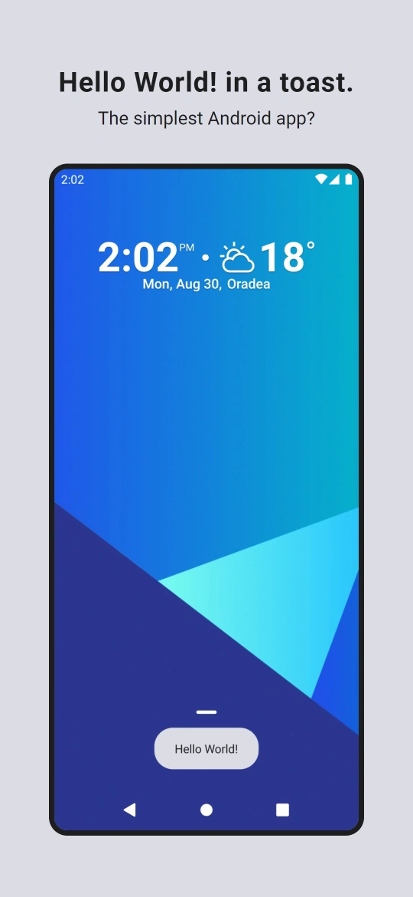
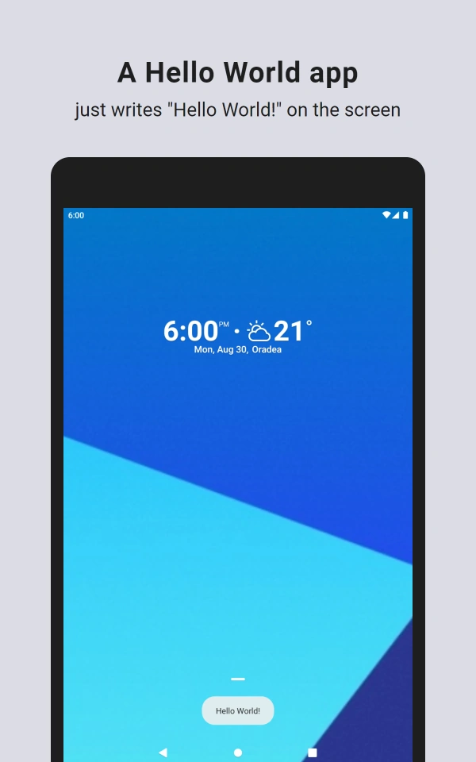

# Hello World Toast

**It may very well be the simplest Android app. Works even on Android 1.0!**

  
  

"Hello World" programs are pretty famous, even if all they do is write "Hello World!" on the screen. When learning a new programming language or platform, starting with such a simple program has become a tradition.

Hello World Toast is a standard Android app, that can be installed on any Android device, and started from the Apps or Home Screen. All it does is display the famous "Hello World!" text in a toast - the familiar Android small popup used to show quick messages to the user. Then the app closes, even before starting. That's it!

(However, Hello World Toast may be useful if you need to show someone how a real Android toast looks like.)

Hello World Toast is tiny (only 23k!), and runs on any Android smartphone, tablet, or device. It runs on the latest Android versions, and even on the oldest versions, starting with Android 1.0!

Hello World Toast is free and open source, doesn't show ads, doesn't require Internet, and doesn't ask for permissions.

## Download

or **[Download from GitHub Releases](https://github.com/TechAurelian/HelloWorldToast/releases/latest)**

## User Reviews (🤣)

> "Simply amazing app. The Hello World toast just... changed my life. Thank you!" (⭐⭐⭐⭐⭐)

> "One thing I look for it n an app is an elegant UI. This developer has changed the app world with a fresh new style of app, that will keep you glued to the screen for hours." (⭐⭐⭐⭐⭐)

> "So simple yet functional!" (⭐⭐⭐⭐⭐)

## Building

To build and run the app, clone this project, open it as an existing project in Android Studio, and click Run.

## Contributing

Thank you for contributing! Hello World Toast is designed to be as simple as possible, but you can still help with:

* testing and reporting bugs
* creating a nice Android app icon to replace the [current one](https://github.com/TechAurelian/HelloWorldToast/blob/primary/app/src/main/res/mipmap-xxxhdpi/ic_launcher.png)

## License

Hello World Toast is released under the [MIT License](https://github.com/TechAurelian/HelloWorldToast/blob/primary/LICENSE).
